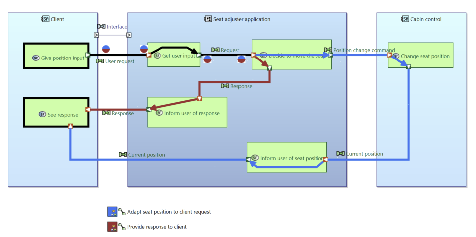
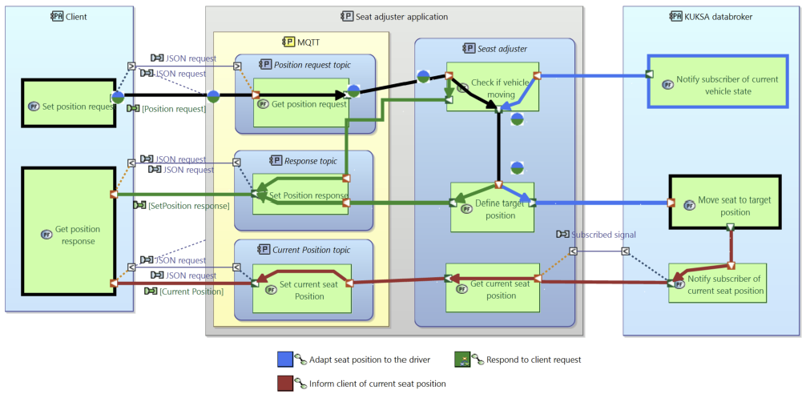

# Architecture of Companion Application

## High-level architecture design with Capella

When starting the development of an application such as this one, you can use the MBSE tool Eclipse Capella to help designing its architecture. In this tutorial, we provide a Capella model to illustrate how the tool, with the Systems Engineering methodology it embeds, can help you to identify needs and define a suitable architecture from there. For more information on Eclipse Capella and how to open the provided model, you can refer to the [dedicated section](./how-to-open-capella-model.md)

The companion application developed in this blueprint is a seat adjuster. The main user need here is to adapt the seat position based on a client's request. This user need is identified during the Operational Analysis stage in Capella which, for this tutorial, can be summarized by the following simple Operational Architecture Diagram:


While defining the application's own capabilities in Capella's System Analysis level, we also determine that the application can accept or refuse the request in certain conditions, for instance, while the vehicle is moving. 
The diagram below from the Capella model represents these features at system level (the full Capella model can be found in folder "Seat adjuster application architecture").



After defining the application's functions in the System Analysis perspective of Arcadia, the Logical and Physical Architecture perspectives helps design and define an architecture that enables the realization of these functions. The Physical Architecture Diagram below represent the final architecture, with the components and interfaces defined during the analysis:




The seat adjuster application interacts with the vehicle through a *Vehicle Abstraction Layer* created by the KUKSA Databroker,
which uses the [Vehicle Signal Specification (VSS)](https://covesa.github.io/vehicle_signal_specification/)
to express the current value and in case of actuators also the desired state of the vehicle signal.
By developing against the abstraction layer, the application becomes independent from the actual physical seat.

To control the position of the driver seat, the seat adjuster sets the target value of the `Vehicle.Cabin.Seat.Row1.Pos1.Position` signal in the KUKSA Databroker.

The architecture assumes so-called actuation providers that apply the changes to the actual vehicle as indicated in the target value, e.g.,
through interaction with the responsible ECUs.
For this tutorial, we do not expect you to interface with an actual vehicle and thus abstract the vehicle by using the Kuksa.Val vehicle mock service.
This vehicle mock service allows the definition of behavior toward the KUKSA Databroker like we would expect from the vehicle, for example,
setting the current value after reacting to changes to the target value of a signal.

```mermaid
flowchart TB
    client[Client]
    anotherClient[Another Client]
    seatadjuster[Seat Adjuster]
    databroker[(KUKSA<br>Databroker)]
    mqttRequest[[MQTT topic<br>seatadjuster/setPosition/request]]
    mockservice[Provider: Mock Service]

    client -- "JSON Request: position, requestId" --> mqttRequest
    anotherClient -.-> mqttRequest
    mqttRequest --> seatadjuster
    seatadjuster -- "Set Target<br>Vehicle.Cabin.Seat.Row1.Pos1.Position<br>gRPC" --> databroker
    databroker <-- "Set Current<br>Vehicle.Cabin.Seat.Row1.Pos1.Position<br><br>Notify subscriber of changed target<br>Vehicle.Cabin.Seat.Row1.Pos1.Position" --> mockservice
```

As interface to the user, we assume a **client** that can, for example, be a local app in the infotainment domain with a user interface
or an off-board application sending the request from a backend.
Either way, the client controls our seat adjuster application through a JSON encoded message over MQTT using the topic `setPosition/request`.

An example request looks like this:

```bash
mosquitto_pub -t seatadjuster/setPosition/request 
    -m '{"position": 1000, "requestId": "12345"}'
```

The position parameter can be any value between 0 and 1000.

## Getting Seat Position

When the seat moves, the provider gets this information, for example, from the seat ECU over the CAN-bus.
We use the mock service as a provider and configure it to set the current value for the `Vehicle.Cabin.Seat.Row1.Pos1.Position` signal in the KUKSA Databroker
after the target value for the signal changes.

To receive the changes to the seat position, the seat adjuster application already subscribed to the current value of the signals and thus gets notified.
As a result, the seat adjuster constructs a JSON message and sends the new seat position to the MQTT-topic `seatadjuster/currentPosition`
where any client can consume it.

The seat adjuster also sends responses to each request received at the MQTT-topic `seatadjuster/request` with a message to the MQTT-topic `seatadjuster/response`
indicating whether it accepted the incoming request and set the target value or whether there was an error like the vehicle currently moving.

```mermaid
flowchart TD
    client[Client]
    anotherClient[Another Client]
    seatadjuster[Seat Adjuster]
    databroker[(KUKSA<br>Databroker)]
    mqttResponse[[MQTT topic<br>seatadjuster/setPosition/response]]
    mqttCurrent[[MQTT topic<br>seatadjuster/currentPosition]]
    mockservice[Provider: Mock Service]

    mockservice -- "Feed/Set<br>Vehicle.Cabin.Seat.Row1.Pos1.Position<br>(Sensor)" --> databroker
    databroker -- "Notify Subscriber<br>Vehicle.Cabin.Seat.Row1.Pos1.Position" --> seatadjuster
    seatadjuster -- "Once after processing<br>/setPosition/request<br>message" --> mqttResponse
    seatadjuster -- "While seat is moving" --> mqttCurrent
    mqttResponse -- "SetPosition Response<br>(Accepted / Error)" --> client
    mqttCurrent --> client

    mqttCurrent -.-> anotherClient
    mqttResponse -.-> anotherClient
```

The next step is to [develop the seat adjuster with the help of Eclipse Velocitas](./develop-seat-adjuster.md).
