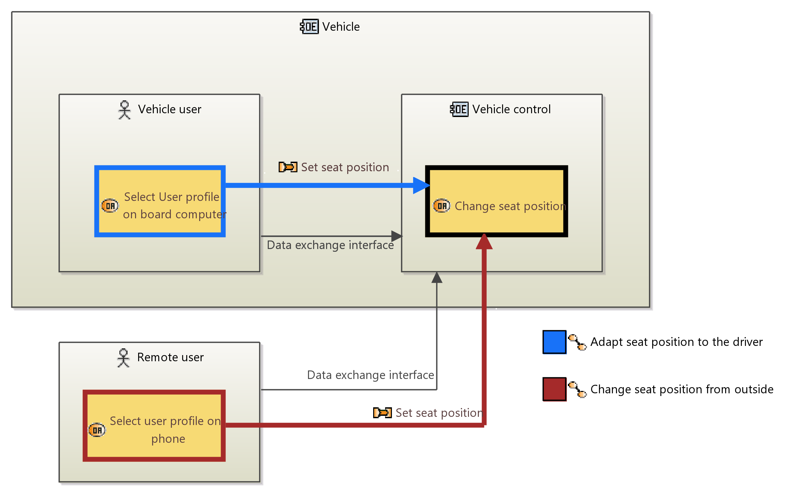
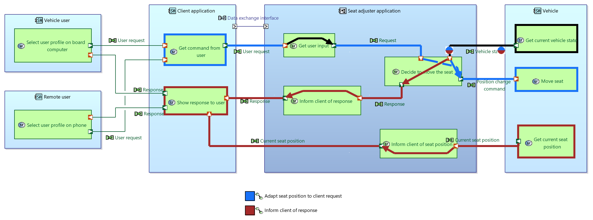
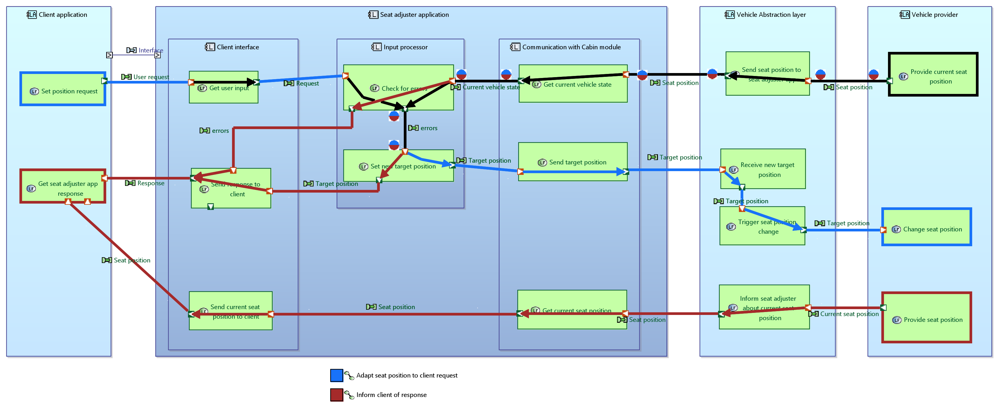
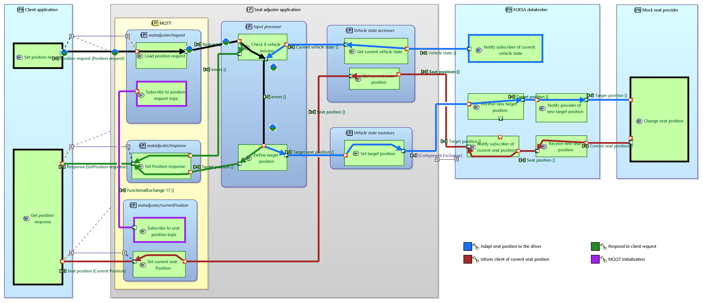

# Modeling the companion application

In this chapter, we suggest a way to design and model the application's architecture using the Arcadia methodology, implemented in Eclipse Capella.

## Introduction to Capella

### What is Capella

Capella is an Eclipse project and an open-source MBSE tool and method to sucesfully design system architecture, providing a comprehensive, industrial-grade and customizable solutions to engineering teams worldwide.
For more information about Capella, you can refer to https://mbse-capella.org

Capella embeds the Arcadia methodology, a method devoted to Systems and Architecture Engineering, that supports understanding of customer needs, definition and sharing of system architecture, and early validation and verification. 
It consists of four major perspectives, with their own goals, that provide guidance along the different of the architecture design process, and featuring a clear distinction between need and solution. The four main perspectives of Arcadia are the following:
- Operational Analysis: What the users of the system need to accomplish. In this step, the architect will define the problem by identifying the system users and actors (human and non-human) who will operate with the system, as well as their operational activities and capabilities.
- System Analysis: What the system has to accomplish for its users. This steps focuses on the system to be designed, the formalization of its requirements and the definition of its functions, that will ensure it can fulfill the user needs (defined at the previous step).
- Logical Architecture: How the system will work to fulfill the expectations. In this perspective, architects build a coarse-grained component breakdown of the system carrying most important engineering decisions, and which is unlikely to be challenged later in the development process.
- Physical Architecture: How the system will be developed and built. This steps defines the system's final architecture. After this step, the system is considered ready to develop for subsequent engineering specialties.

For more information about the Arcadia methodology, you can for instance refer to https://mbse-capella.org/arcadia.html.

### Installing and running Capella

To run Capella, go to the download page (https://mbse-capella.org/download.html) and download the zip corresponding to the latest release of Capella.
Once the download is complete, you can simply unzip it to the location of your choice (preferably using 7zip). Then, run capella.exe in the Capella folder.

### Opening the Capella model

To open the Capella model, check first that you have the folder locally saved on your device.
Then, in Capella, go to the File menu and select "Open Projects from File System", then click the Directory button, select the root directory in which the .aird file of the project is contained, and click "Finish".
You can then open the project and show the diagrams by double-clicking the .aird file of the project.

## High-level architecture design with Capella

When starting the development of an application such as this one, you can use the MBSE tool Eclipse Capella to help designing its architecture. In this tutorial, we provide a Capella model to illustrate how the tool, with the Systems Engineering methodology it embeds, can help you to identify needs and define a suitable architecture from there. For more information on Eclipse Capella and how to open the provided model, you can refer to the [dedicated section](./how-to-open-capella-model.md)

### Operational Analysis

The companion application developed in this blueprint is a seat adjuster. The main user need here is to adapt the seat position based on a client's request. In the Arcadia methodology, this requirement is captured in the Operational analysis, along with the main actors, i.e. stakeholders of the considered cases, who will interact with the system to achieve missions, goals and objectives.

The Operational Analysis for this tutorial, identifies two Operational actors corresponding to two users, who will want to have the seat position adapted to their profile. One wants to give this instruction while seated inside the car, and the other remotely. Another Operational Entity is the vehicle, which must react to the user's input. The analysis can be summarized by the Operational Architecture Diagram shown below. Note that, at this stage, the scope of the application to be designed (or system) is not defined yet, so as to keep it open.

### System Analysis

In the Arcadia methodology, the System Analysis aims at refining the Operational Analysis, and defining the Sytem of Interest's (here the Companion application) boundaries, namely the functions it will perform for the stakeholder. At this stage, the System is studied as a black box: we focus on what the system will do, in a solution-neutral way. 

The diagram below from the Capella model represents these features at system level (the full Capella model can be found in the "Seat adjuster application architecture" folder). It now introduces the System of interest, here the companion application, as an entity, as opposed to the Operational Analysis where we voluntarily did not define it. It also defines a first, high-level allocation of functions to each entity.

At this stage, we decided to add a Client Application between the users and Companion Application, that will gather the inputs from the users and forward them to the Companion Application. This Client Application can for instance be an app running on a user's phone, or on the car's board computer. This addition corresponds to a design decision: The Companion Application will not be responsible for providing an interface to the users, but will only get standardized inputs from another application.

While defining the Companion Application's own capabilities in Capella's System Analysis level, we also determine that the application can accept or refuse the request in certain conditions, for instance, while the vehicle is moving. 

The diagram below from the Capella model represents these features at system level (the full Capella model can be found in folder "Seat adjuster application architecture").

### Logical Architecture

After defining the application's functions in the System Analysis perspective of Arcadia, the Logical Architecture perspective helps design and define an architecture that enables the realization of these functions. 
This perspective provides a first break-down of the system and a notional view of components without taking care yet of the technological detail (i.e. we do not yet try to decide what exactly each component will be, as this will be done in the next step). We also allocate the Functions to the Logical Components that we defined.

In this instance, we define three Logical Components: One will be responsible for commuincating with the Client App, one will manage the internal logics of the Companion Application (Input processor), and the last one will be in charge of communicating with the Vehicle. The definition of these components also goes with a further refinement of the functions.

Note that, at this stage of the architecture design, we make the decision to break down the Actor "Vehicle" from the System Analysis into two Logical Actors, "Vehicle Abstraction Layer" and "Vehicle provider". 

### Physical Architecture

Finally, based on the abstract breakdown realized in the Logical Architecture, we can define the concrete Physical Components that will compose the system (despite their naming, Physical Components can be software as well as physical parts).

The goal of the Physical Architecture is to extensively describe the final solution, specifying in particular the specific technologies that will be used. It is at this stage that we can decide, for instance, that the "Vehicle Abstraction Layer" defined in the Logical Architecture will be a KUKSA Databroker, or that interface of the application with the user will be composed of MQTT Topics, and will communicate with the client through JSON requests etc.

Once again, the definition of these Physical Components can go hand-in-hand with further refinement, or even the addition of some Functions. For example, as we now defined that the Companion Application will use MQTT, we also need to add Functions corresponding to the subscriptions to the relevant MQTT topics, that will take place at the initialization of the app.

The next step is to [start developing the application with Eclipse Velocitas](./deploy-seat-adjuster.md).
